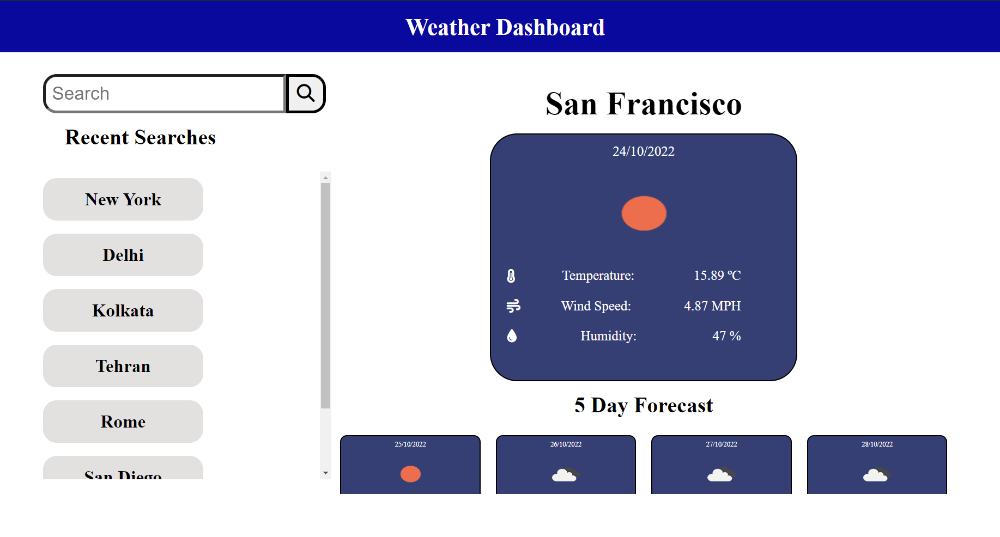

## Weather Dashboard
This Weather Dashboard App is built with HTML, CSS , JavaScript and JQuery. It uses OpenWeather API to get the weather information and 5 day forcast. Users can search for cities which get persisted in the local storage and displayed in the Recently Searched column.

## Application Screenshot

## Links
- Repository Link : https://github.com/nickthepriest76/weather-dashboard
- Deployment Link : https://nickthepriest76.github.io/weather-dashboard/
